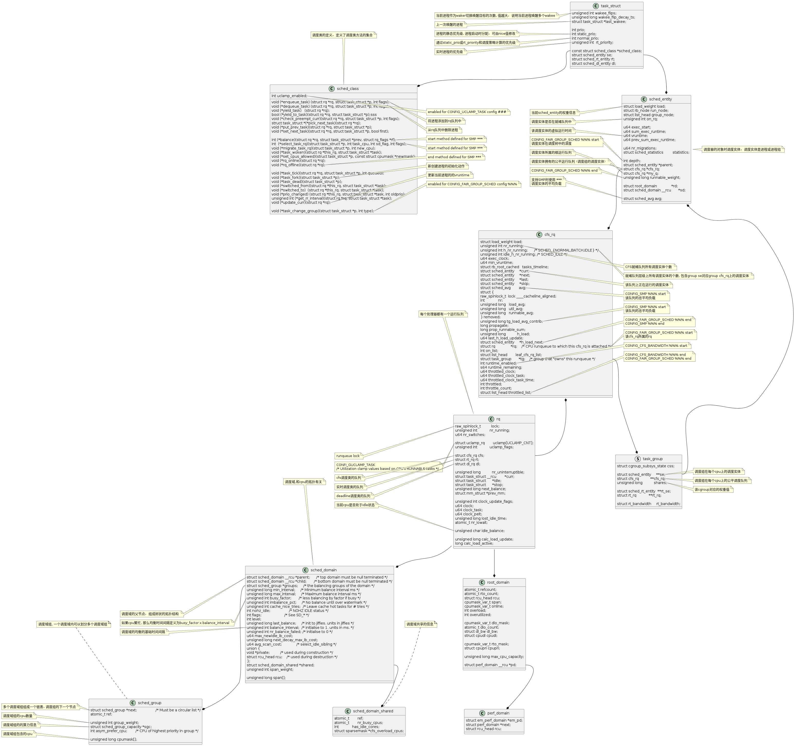

## 调度相关的结构体

<div align="center">
  
</div> 

## 常用的调度类

| 调度类 | 调度策略 | 调度对象| 调度算法 | 优先级 |
| ---- | ----| ---- | ---- | ---- |
| stop_sched_class | 无 | 停机进程, 目前只有migration进程使用 | 优先级高抢占其他进程 | 1(高) |
| dl_sched_class | SCHED_DADLINE | 限期进程 | 优先选择截至期最小的进程 | 2 |
| rt_sched_class | SCHED_FIFO <br> SCHED_RR | 实时进程 | 先进先出 <br> 轮流调度 | 3 |
| fair_sched_class | SCHED_NORMAL <br> SCHED_IDLE  | 普通进程 | 公平调度算法 | 4 |
| idle_sched_class | 无 | idle进程 | 无 | 5（低）|

## 进程调度的时机

1. 进程执行阻塞的操作时， 如获取信号量、互斥锁， 等待队列时。
2. 周期性的调度，抢占当前进程。
3. 在中断返回前或系统调用返回用户空间时， 检查TIF_NEED_RESCHED标志位。
4. 唤醒进程的时候， 被唤醒进程可能抢占当前进程。
5. 创建新进程时候， 新进程可能抢占当前进程。


## 进程调度的优先级

task_struct中表示进程优先级有四个变量， 分别是prio、static_prio、normal_prio和rt_priority;


| 优先级 | 限期进程 | 实时进程 | 普通进程 |
| ---- | ----| ---- | ---- |
| prio | 调度优先级， 值越小优先级越高， 大部分情况=static_prio | 同限期进程 | 同限期进程 |
| static_prio | 0（无意义） | 0（无意义） | 120 + nice值， 数值越小，优先级越高 <br> nice值的范围为-20～10 |
| normal_prio | -1 | 99 - rt_priority | static_prio |
| rt_priority | 0（无意义）  | 取值范围1～99, 值越大， 优先级越高 | 0（无意义） |


## 调度进程

### 选择下一个进程

调度进程的核心实现是__schedule()函数, 该函数主要包括两部分内容：

(1) 选择下一个调度的进程

(2) 执行进程的切换

```
static void __sched notrace __schedule(bool preempt)
{
        struct task_struct *prev, *next;
        unsigned long *switch_count;
        unsigned long prev_state;
        struct rq_flags rf;
        struct rq *rq;
        int cpu;

        cpu = smp_processor_id();   //获取当前的cpu
        rq = cpu_rq(cpu);
        prev = rq->curr;            //prec指向当前运行的进程

        local_irq_disable();        // 关闭本地中断
        rcu_note_context_switch(preempt);

        rq_lock(rq, &rf);
        smp_mb__after_spinlock();

        /* Promote REQ to ACT */
        rq->clock_update_flags <<= 1;
        update_rq_clock(rq);

        switch_count = &prev->nivcsw;

        prev_state = prev->state;
        if (!preempt && prev_state) {       // 非抢占且当前进程不处于running状态（非0）
                if (signal_pending_state(prev_state, prev)) {    // 如果为TASK_INTERRUPTIBLE或有kill信号待处理，重新置为running状态
                        prev->state = TASK_RUNNING;
                } else {
                        prev->sched_contributes_to_load =
                                (prev_state & TASK_UNINTERRUPTIBLE) &&
                                !(prev_state & TASK_NOLOAD) &&
                                !(prev->flags & PF_FROZEN);

                        if (prev->sched_contributes_to_load)
                                rq->nr_uninterruptible++;

                        deactivate_task(rq, prev, DEQUEUE_SLEEP | DEQUEUE_NOCLOCK);  // 非running状态的进程从队列中删除

                        if (prev->in_iowait) {
                                atomic_inc(&rq->nr_iowait);
                                delayacct_blkio_start();
                        }
                }
                switch_count = &prev->nvcsw;
        }

        next = pick_next_task(rq, prev, &rf);           //选择下一个进程
        clear_tsk_need_resched(prev);
        clear_preempt_need_resched();
        if (likely(prev != next)) {
                rq->nr_switches++;

                RCU_INIT_POINTER(rq->curr, next);
                ++*switch_count;
                psi_sched_switch(prev, next, !task_on_rq_queued(prev));

                trace_sched_switch(preempt, prev, next);
                rq = context_switch(rq, prev, next, &rf);             // 执行进程的切换
        } else {
                rq->clock_update_flags &= ~(RQCF_ACT_SKIP|RQCF_REQ_SKIP);
                rq_unlock_irq(rq, &rf);
        }

        balance_callback(rq);
}
```

pick_next_task()函数

```
static inline struct task_struct *
pick_next_task(struct rq *rq, struct task_struct *prev, struct rq_flags *rf)
{
        const struct sched_class *class;
        struct task_struct *p;
        
        if (likely(prev->sched_class <= &fair_sched_class &&
                   rq->nr_running == rq->cfs.h_nr_running)) {  //表示就绪队列只有公平调度类的普通进程

                p = pick_next_task_fair(rq, prev, rf);
                if (unlikely(p == RETRY_TASK))
                        goto restart;

                /* Assumes fair_sched_class->next == idle_sched_class */
                if (!p) {
                        put_prev_task(rq, prev);
                        p = pick_next_task_idle(rq);   // cfs队列中没有进程则下一个进程设置为idle进程。
                }

                return p;
        }

restart:
        put_prev_task_balance(rq, prev, rf);   //调用对应调度类的balance并重新放入调度队列

        for_each_class(class) {
                p = class->pick_next_task(rq);   // 按调度类的优先级选择下一个进程
                if (p)
                        return p;
        }

        /* The idle class should always have a runnable task: */
        BUG();
}

```

### 进程切换


```
__always_inline struct rq *
context_switch(struct rq *rq, struct task_struct *prev,
               struct task_struct *next, struct rq_flags *rf)
{
        prepare_task_switch(rq, prev, next);         //执行进程切换的准备工作， 获取锁和结构体特定的准备工作

        arch_start_context_switch(prev);

        /*
         * kernel -> kernel   lazy + transfer active
         *   user -> kernel   lazy + mmgrab() active
         *
         * kernel ->   user   switch + mmdrop() active
         *   user ->   user   switch
         */
        if (!next->mm) {                                //next为内核进程，借用前一个进程的虚拟地址空间
                enter_lazy_tlb(prev->active_mm, next);

                next->active_mm = prev->active_mm;
                if (prev->mm)                           // from user
                        mmgrab(prev->active_mm);       // 前一个进程的内存应用计数加一
                else
                        prev->active_mm = NULL;
        } else {                                        // to user
                membarrier_switch_mm(rq, prev->active_mm, next->mm);

                switch_mm_irqs_off(prev->active_mm, next->mm, next);  //切换虚拟地址空间， ARM64为通用定义switch_mm()
                lru_gen_use_mm(next->mm);

                if (!prev->mm) {                        // from kernel
                        /* will mmdrop() in finish_task_switch(). */
                        rq->prev_mm = prev->active_mm;
                        prev->active_mm = NULL;
                }
        }

        rq->clock_update_flags &= ~(RQCF_ACT_SKIP|RQCF_REQ_SKIP);

        prepare_lock_switch(rq, next, rf);
        /* Here we just switch the register state and the stack. */
        switch_to(prev, next, prev);  // 切换寄存器和栈
        barrier();

        return finish_task_switch(prev);      // 进程切换后的清理工作
}EXPORT_SYMBOL(context_switch);

```

context_switch() -> switch_mm_irqs_off() -> switch_mm()

```
static inline void __switch_mm(struct mm_struct *next)
{
        /*
         * init_mm.pgd does not contain any user mappings and it is always
         * active for kernel addresses in TTBR1. Just set the reserved TTBR0.
         */
        if (next == &init_mm) {
                cpu_set_reserved_ttbr0();
                return;
        }

        check_and_switch_context(next); // 分配进程描述符， ARM64为asid
}

static inline void
switch_mm(struct mm_struct *prev, struct mm_struct *next,
          struct task_struct *tsk)
{
        if (prev != next)
                __switch_mm(next);

        /*
         * Update the saved TTBR0_EL1 of the scheduled-in task as the previous
         * value may have not been initialised yet (activate_mm caller) or the
         * ASID has changed since the last run (following the context switch
         * of another thread of the same process).
         */
        update_saved_ttbr0(tsk, next);
}
```

context_switch() -> switch_to() -> __switch_to(), 切换寄存器
```
__notrace_funcgraph struct task_struct *__switch_to(struct task_struct *prev,
                                struct task_struct *next)
{
        struct task_struct *last;

        fpsimd_thread_switch(next);    // 切换浮点寄存器
        tls_thread_switch(next);
        hw_breakpoint_thread_switch(next);
        contextidr_thread_switch(next);
        entry_task_switch(next);   // 每cpu变量存储next的地址
        ssbs_thread_switch(next);
        erratum_1418040_thread_switch(next);

        /*
         * Complete any pending TLB or cache maintenance on this CPU in case
         * the thread migrates to a different CPU.
         * This full barrier is also required by the membarrier system
         * call.
         */
        dsb(ish);

        /*
         * MTE thread switching must happen after the DSB above to ensure that
         * any asynchronous tag check faults have been logged in the TFSR*_EL1
         * registers.
         */
        mte_thread_switch(next);

        /* the actual thread switch */
        last = cpu_switch_to(prev, next);

        mpam_sched_in();

        return last;
}
```


<br>
转载请注明： [【sched】一、进程调度的基础](https://dracoding.github.io/2023/05/进程调度(1)/) 